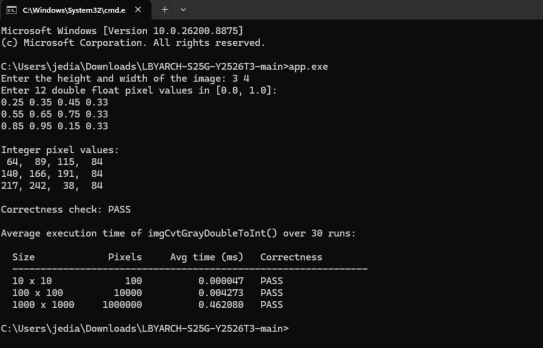

# LBYARCH MP2 — x86-to-C Interface Programming Project

This project converts grayscale image pixels from double precision floats in `[0.0, 1.0]`
to unsigned bytes in `[0, 255]`. The conversion function, `imgCvtGrayDoubleToInt()`, is
written entirely in x86-64 assembly using **scalar SIMD registers and scalar SIMD
floating-point instructions**. The C program handles input, memory allocation, output,
correctness checking, and timing.

## Files

| File | Description |
|---|---|
| `DeCaJVallJMP2.asm` | `imgCvtGrayDoubleToInt()` in x86-64 assembly (NASM, Windows x64 ABI) |
| `DeCaJVallJMP2.c` | Input collection, memory allocation, output printing, correctness check, timing |
| `build.bat` | Assembles and links the project |
| `sample.txt` | The 3 × 4 example image from the specifications |

## Building and running

Requires **NASM** and a C compiler (**GCC/MinGW-w64**), both on `PATH`.

```bat
nasm -f win64 DeCaJVallJMP2.asm -o DeCaJVallJMP2.obj
gcc DeCaJVallJMP2.c DeCaJVallJMP2.obj -o app.exe
```

or simply run `build.bat`. Then:

```bat
app.exe                 REM type the image in by hand
app.exe < sample.txt    REM use the example from the specifications
```

The program first converts the image you supply and prints it, then runs the timing
benchmark for the three required sizes.

Built and tested with **NASM 2.15.05** and **GCC 16.1.0 (MinGW-w64, x86_64-win32-seh)** on
Windows 11.

## The function

```c
void imgCvtGrayDoubleToInt(int height, int width, const double *input, unsigned char *output);
```

Under the Windows x64 calling convention, the arguments arrive in `ECX`, `EDX`, `R8`, and
`R9`. The function treats the image as one flat array of `height * width` pixels. For each
pixel, it does the following:

| Instruction | Purpose |
|---|---|
| `movsd xmm0, [r8 + r11*8]` | scalar double load of `input[i]` |
| `mulsd xmm0, xmm1` | scalar double multiply by `255.0` |
| `cvtsd2si eax, xmm0` | scalar double → integer, rounded to nearest |
| `mov [r9 + r11], al` | store the resulting byte into `output[i]` |

The function only uses volatile registers (`RAX`, `R10`, `R11`, `XMM0`, `XMM1`), so it does
not need to save or restore any registers.

### The conversion equation

The specifications give the ratio and proportion equation `f / i = 1 / 255`, which
rearranges into `i = f × 255`. `CVTSD2SI` rounds using the default MXCSR mode,
round-to-nearest-even. So the function computes `i = round(f × 255)`.

## Correctness check

`DeCaJVallJMP2.c` also contains a plain C version of the same conversion,
`imgCvtGrayDoubleToIntRef()`. It uses `rint()`, which rounds to the nearest value with ties
going to even — the same rule `CVTSD2SI` uses. After every conversion, the program compares
all `height × width` output bytes from the assembly function against this reference and
prints the first mismatch, if any. This check runs on the image you supply and on all three
benchmark sizes, including the full 1,000,000-pixel image.

**All four checks pass**, so the assembly function produces the exact same output as the C
reference across 1,010,112 pixels per program run.

Boundary values work as expected: `0.0` becomes `0`, `1.0` becomes `255`, and `0.5` becomes
`128` (127.5 is an exact tie, so it rounds to the nearest even number).

### A note on the sample output in the specifications

The function's output for the example image differs from the published sample at two
pixels:

| | Column 1 | Column 2 | Column 3 | Column 4 |
|---|---|---|---|---|
| **This program** | 64, 140, **217** | 89, 166, 242 | **115**, 191, 38 | 84, 84, 84 |
| **Specifications** | 64, 140, **216** | 89, 166, 242 | **114**, 191, 38 | 84, 84, 84 |

This difference is not caused by floating-point rounding error. In IEEE-754 double
precision, the four relevant products are exact: `0.25 × 255 = 63.75`,
`0.45 × 255 = 114.75`, `0.65 × 255 = 165.75`, and `0.85 × 255 = 216.75`. None of these is a
`.5` tie, so round-to-nearest gives one clear answer for each: 64, 115, 166, and 217.

The published sample rounds two of these four `.75` values up (0.25 → 64, 0.65 → 166) and
the other two down (0.45 → 114, 0.85 → 216). No single rounding rule produces this result.
We checked both reasonable versions of the equation, and neither one matches:

| Rule | Result | Matches sample? |
|---|---|---|
| `round(f × 255)` | 64, 89, **115**, 140, 166, 191, **217**, 242, 38 | 10 of 12 pixels |
| `trunc(f × 255)` | **63**, 89, 114, 140, **165**, 191, 216, 242, 38 | 10 of 12 pixels |
| `round(f ÷ (1/255))` | identical to `round(f × 255)` | 10 of 12 pixels |
| `trunc(f ÷ (1/255))` | identical to `trunc(f × 255)` | 10 of 12 pixels |

We chose round-to-nearest because it is the correct way to read the ratio and proportion
equation, it is the default behavior of `CVTSD2SI` (the required instruction), and it keeps
the error smaller (at most ±0.5, versus ±1.0 for truncation). Truncation would match the
same number of sample pixels, but it would be less accurate.

## Execution time and performance analysis

Averaged over **30 runs** per image size, timing the assembly function only.

| Size | Pixels | Average time (ms) | Time per pixel | Correctness |
|---:|---:|---:|---:|:---:|
| 10 × 10 | 100 | 0.000023 | ~0.23 ns | PASS |
| 100 × 100 | 10,000 | 0.002100 | ~0.21 ns | PASS |
| 1000 × 1000 | 1,000,000 | 0.204983 | ~0.20 ns | PASS |

Test machine: AMD Ryzen 9 9950X3D (16 cores, 4.3 GHz base), 64 GB RAM, Windows 11 Pro.

**Methodology.** Timing uses `QueryPerformanceCounter`. Only the call to
`imgCvtGrayDoubleToInt()` is inside the timed region. Random pixel generation, memory
allocation, printing, and the correctness check all happen outside it. The 30 runs are
timed together as one batch and then divided by 30, because a single 10 × 10 call is much
shorter than one timer tick. Pixel data is random in `[0.0, 1.0]` but uses a fixed seed, so
runs are reproducible.

**Analysis.**

- **Scaling is linear.** Going from 100 to 10,000 pixels (100× more pixels) costs 91× more
  time, and going from 10,000 to 1,000,000 pixels (100× more pixels) costs 98× more time.
  This matches what we would expect from the function's single loop, which does one load,
  one multiply, one convert, and one store for every pixel, no matter the image size.

- **The cost per pixel stays flat** at roughly 0.2 ns, or about one CPU cycle per pixel at
  boost clock speed. The loop is short enough that the processor can work on several pixels
  at once, and since each pixel is independent, one pixel's calculation never has to wait
  for the pixel before it.

- **The largest image is not memory-bound.** This is a bit surprising, since the
  1000 × 1000 input is 8 MB of doubles plus 1 MB of output, which would normally overflow
  the cache and slow things down. This test machine has a very large L3 cache (3D V-Cache),
  so the data still fits, and the 30 back-to-back runs keep reading the same warm data. On a
  machine with a smaller cache, the 1000 × 1000 result would likely be slower per pixel than
  the 100 × 100 result, while the two smaller sizes would stay about the same.

- **The 10 × 10 result is at the limit of what the timer can measure.** 30 runs of a
  100-pixel image take less than a microsecond in total, which is only a few
  `QueryPerformanceCounter` ticks. Because of this, the value for this row moves between
  about 0.000023 and 0.000043 ms across different runs of the program. It should be read as
  "too fast to measure precisely," not as an exact figure. The 100 × 100 and 1000 × 1000
  rows stay stable within a few percent.

- **Function call overhead is negligible.** If we extend the steady-state rate of 0.205 ns
  per pixel to a 100-pixel image, we would expect about 20 ns. We measured about 23 ns,
  which leaves only a couple of nanoseconds for the function call, the pixel-count
  calculation, and the loop setup.

## Screenshot of the program output with the correctness check

For reference, here is the console output shown in the screenshot (`app.exe < sample.txt`):



```
Enter the height and width of the image: Enter 12 double float pixel values in [0.0, 1.0]:

Integer pixel values:
 64,  89, 115,  84
140, 166, 191,  84
217, 242,  38,  84

Correctness check: PASS

Average execution time of imgCvtGrayDoubleToInt() over 30 runs:

  Size             Pixels     Avg time (ms)   Correctness
  ---------------------------------------------------------------
  10 x 10             100          0.000023   PASS
  100 x 100         10000          0.002100   PASS
  1000 x 1000     1000000          0.204983   PASS
```

## Video
(https://youtu.be/yt0n51vFDe4?si=eanUynAHNA_6NQrT)
